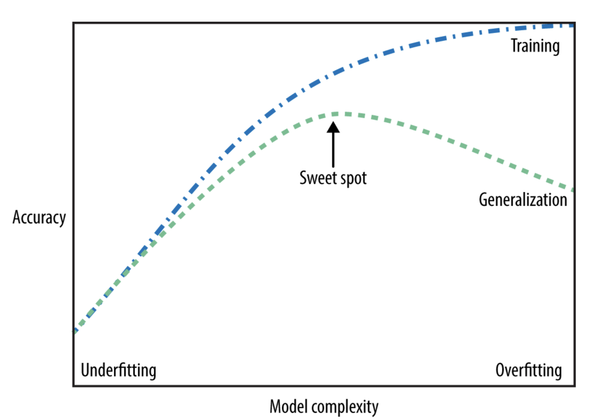

# Supervised ML, seriously
The supervised learning normally requires human effort to build the training set, specially for the training output. But can be automated afterwards once data are ready.

## 2 major types of supervised ml
- **Classifiction**
  
  with goal to predict a *class label* , that should be chosen from a predefined list. Can be further break down to 2 sub types:
  - binary classification (yes/no question), **EX**: spam mail.
  - multiple classes classification, **EX**: the above iris one, or like predict which language a website is in.

- **Regression**

  with goal to predict a *continous (floating point) number*.

  **EX** : predict a person's annual income based on their age, education, location, the result is an *amount*, which can be any number within a range. Or predict the yield (产量) of a corn field based on last year's yield & weather, ect.

**The difference between those 2 is the *continuity* of the output, if one should have precise output, without something in between, then it should be a classification, otherwise, like incomes, 3999 & 4001 doesn't make much difference.**

## About models
The key metric to a model that hits the sweetpoint: **generalization**, the ability to make accurate prediction on **unseen data**, that's the whole point of ml models. 

Normaly, simple model generalize better to new data. If we create a *too complex* model based on existing dataset, we risk having:

- **overfitting**: which means you fit a model too closely to the *particularities* of training set -- it's not general enough. => **Normally shows high accuracy on training set, and low accuracy on test set**.

But if we have a model *too simple*, like 'anyone with a house will buy a boat', then we will have :

- **underfitting**: that ignored too much varaibilities of the dataset, which will not perform well even on training set. => **Normally shows low & very close accuracy on both training set and test set**.

💩 So our model cannot be neither too simple nor too complex, we need to find a sweet point between those 2, and the tradeoff of **overfitting** and **underfitting** can be shown as below:
 

**model complexity is relative with data size**

The more data we have, the more complex can be the model, without overfitting. (样本越大多样性越强，所以更不容易被单一化).

## List of common supervised ml models

#### Side note about some `python` & `NumPy` functions:
- `np.bincount` can be used to count the *occurence* of a value inside an array of `int`, manual [here](https://docs.scipy.org/doc/numpy/reference/generated/numpy.bincount.html). 

  Put it in human readable language: feed it an array, `bincount` will
  - first take the *largest* int, to decide the output array size. 
  - then count how many times each value appeared
  - you can add a second param known as `weight`, which should be exactly the same shape of input array

  Ex:
  ```python
  x = np.array([9,9,8])
  # the output array size will be 10 as the largest int is 9
  print('count of each value:', np.bincount(x))
  # [0 0 0 0 0 0 0 0 1 2]
  # 8 appeared once, 9 appeared twice, all other values from 0-7 appeared 0 time. 

  # using weight
  w = np.array([0.5, 0.3, 1])
  print('count of value with weight:', np.bincount(x, w))
  # [0. 0. 0. 0. 0. 0. 0. 0. 1. 0.8]
  ```

- `zip` is a python BIF used to zip 2 arrays together, returns an *iterator of tuples*, where the `i`-th tuple corresponds with `i`-th elements in each array (the longer array is truncated).

#### Preparing the data
- We can include some derived features from the *products* of original features, it's called **feature engineering**. We can use the combination of `k` elements from a set of `n` elements, called *`n` choose `k`*.

## Next
Various types of supervised ml models, [start with knn](/03-supervised-ml-knn.md).